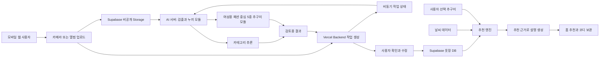
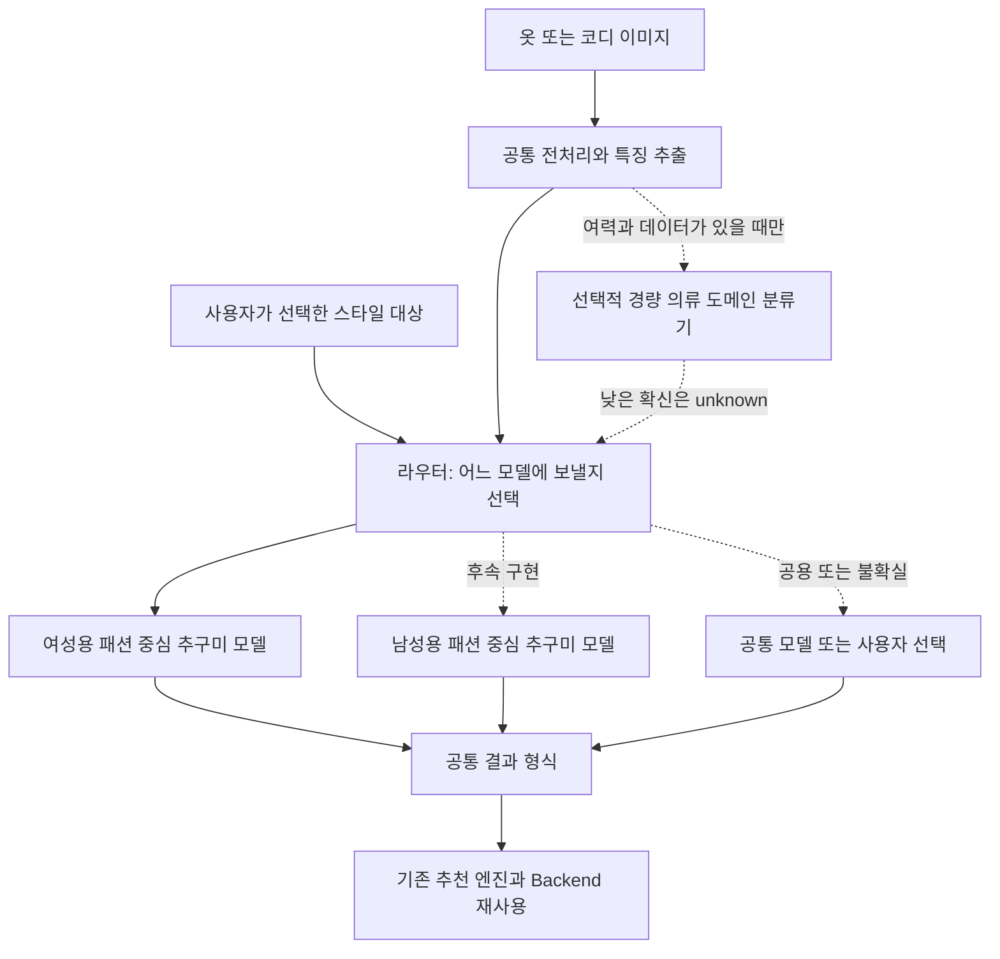

# 마피코 AI 아키텍처 분리 및 확장 설계

2026-09-28 추가 회의 내용을 반영한 **설계안**. 아래 모델이 학습·배포됐다는 뜻이 아니다.

## 아키텍처 분리란?

옷 등록, 스타일 판단, 코디 조합, 설명 생성을 하나의 거대한 모델/함수에 묶지 않고 **역할과 입력·출력을 나누는 것**이다. 초기에는 한 AI 서버 안의 모듈로 분리해도 된다. 기능마다 서버를 따로 만들거나 모델을 반드시 하나씩 학습해야 한다는 뜻은 아니다.

| 구성요소 | 책임 | 실패 시 대안 |
|---|---|---|
| 등록 Vision | 의류 검출·누끼·카테고리 | 단건 등록/수동 카테고리 수정 |
| 추구미 추론 | 이미지와 5종 카탈로그의 부합 점수 | 낮은 확신 표시·사용자 선택 |
| 추천 엔진 | 내 옷·날씨·취향 제약으로 조합 | 후보 부족 안내·수동 코디 |
| 설명 생성 | 이미 선택된 조합의 이유를 표현 | 템플릿 문장 |
| Backend | 사용자 권한·저장·작업 상태·API | 재시도/오류 상태 |
| 웹 UI | 결과 검토·수정·보관·착용 기록 | 샘플/미연결 상태 구분 |

## 1. 이번 개발의 목표 구조

현재 구현된 것은 HTTP 배포/연결 확인 골격과 스키마다. 위 제품 흐름은 구현 목표이며 여성용 추구미 파인튜닝 성공을 전제하지 않는다. 무거운 학습/추론과 짧은 API 요청 처리를 분리한다. TPO 입력은 유지 여부 결정 전 구조의 필수 입력으로 고정하지 않는다.

## 2. 남성용 스타일로 확장하는 후속 구조

- 회의에서 말한 성별 분류 모델은 기술적으로 **의류/스타일 대상 도메인 라우팅**으로 정의하는 편이 명확하다. 사진 속 사람의 성별 정체성을 판단하는 기능으로 만들지 않는다.
- 여성용/남성용/공용은 스타일 지원 범위이며 사용자 성별을 입력 제한으로 삼지 않는다. 오분류·공용 의류를 고려해 unknown/수동 선택 경로를 둔다.
- 초기 라우팅은 사용자의 선택만으로 가능하다. 별도의 경량 모델은 필수 조건이 아니다.
- 경량화는 모델 크기/추론 비용을 줄이는 작업, 파인튜닝은 데이터로 가중치를 조정하는 학습이다. 같은 말이 아니다. 모델 선택과 평가 후 필요할 때 각각 수행한다.
- 여력이 없으면 이 확장 그림과 인터페이스 설계만 발표 산출물로 제공한다. 구현/성능 검증했다고 쓰지 않는다.

## 3. 교체 가능한 모델 계약 — 제안

공통 입력: image_ref, input_kind(garment/outfit), 사용자가 선택한 style_domain, taxonomy_version.
공통 출력: category, style_scores, confidence/unknown, model_version, taxonomy_version, 오류 상태.

점수 키는 display label 문자열이 아닌 버전 관리되는 category code를 사용한다. 5종 이름이 바뀌어도 Backend의 기본 옷장/코디 구조 전체를 다시 만들지 않도록 카탈로그와 모델 버전을 분리한다. 남성용 모델이 기존 여성용과 같은 5종 체계를 쓸지는 별도 결정이다.

## 4. 학습 단계와 완료 기준

1. 5종 이름·정의·포함/제외 사례를 먼저 선정.
2. 허용된 이미지의 소규모 평가셋을 고정하고 사전학습 모델 baseline 측정.
3. 오류를 보고 파인튜닝할지, 분류 체계를 수정할지 판단.
4. 클래스별 precision/recall, macro-F1, 혼동행렬과 실제 사용자 사진 성능을 함께 확인.
5. 옷 단품 추구미와 착장 전체 추구미가 같은 문제라고 가정하지 않음. 단품에 판단 근거가 부족하면 unknown 또는 사용자 취향을 사용.
6. 수치 목표·테스트 장비·입력크기·지연시간 측정 구간은 실험 후 합의. 초기 90%/2초를 확정 성능으로 제시하지 않음.

이 문서는 설계 제안이며 특정 모델/서버 제품의 도입 결정을 대신하지 않는다.
