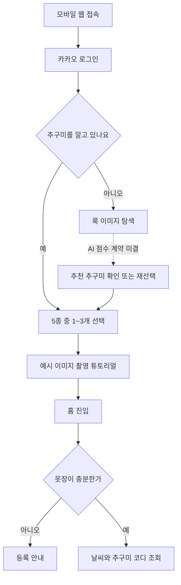
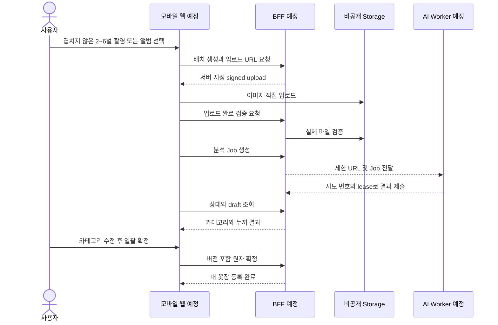
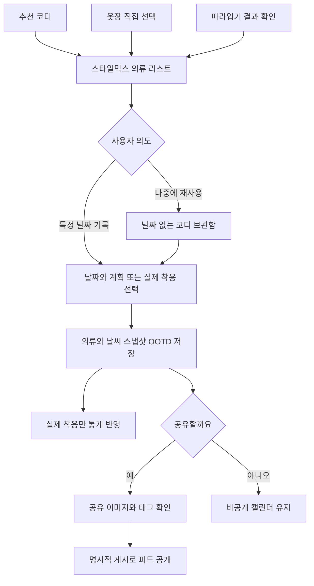
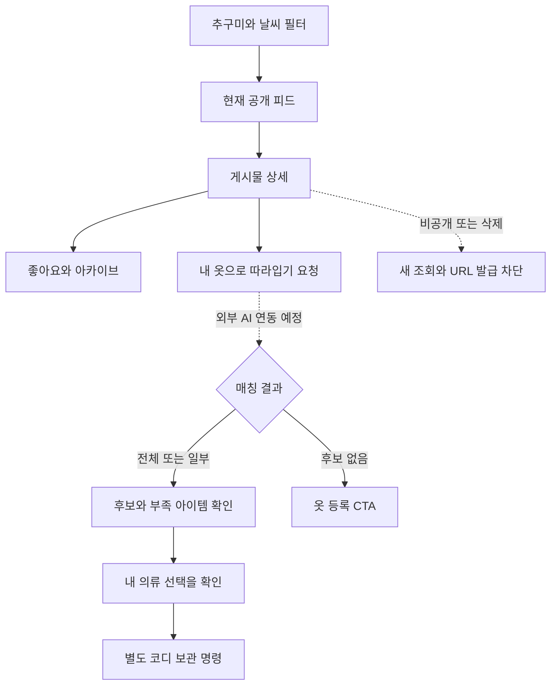

# 마피코(MyFit:Core) 모바일 웹 사용자 흐름

2026-09-28 최신 PRD 기준 **구현 예정 흐름**이다. 현재 배포된 health/readiness 점검 외에 아래 제품 API와 화면이 완성됐다는 뜻이 아니다. 실선은 제품 요구 연결, 점선은 미결 분기 또는 미구현 외부 연동이다.

## 1. 온보딩과 첫 사용

첫 실물 촬영은 온보딩 완료 필수가 아니다. 대표+보조 가중치, 룩 이미지 수와 채점은 AI 합의 대상이다.

## 2. 다중 등록

완전 실패만 재시도하며 부분 성공은 성공한 의류를 검토하거나 새 촬영으로 보완한다. 색상·추구미 편집은 최신 UI에서 제외한다. 원본 예측은 내부에 보존한다.

## 3. 보관·착용·공유

보관함 편집으로 과거 기록을 변경하지 않는다. 하루1개는 현재 DB의 임시 제약이며 팀 결정 대상이다. 미래 날짜는 planned, 별점은 실제 착용 후 선택 입력으로 제안한다. OOTD 저장과 공개 동의를 분리한다.

## 4. 피드와 따라입기

매칭 점수는 확률이 아니다. 타인 의류 ID나 개인 원본 경로는 내 매칭 결과에도 노출하지 않는다. 원본이 비공개로 바뀌면 아카이브와 매칭 결과 조회에서도 가시성을 재확인한다.

## 5. 미결 분기

- TPO는 홈 칩에서 제외됐다. 추천 로직 유지 여부는 팀 확인 전이며 자동 기본값을 적용하지 않는 계약 제안이다.
- 05:00/07:00 사전 생성, 하루 여러 착장, 착장샷 독립 보관 정책은 미결이다.
- 신고/차단/모더레이션은 공개 테스트 범위와 함께 정해야 한다. 최신 PRD 필수로 임의 추가하지 않았으나 실제 공개 운영 전에 별도 검토가 필요하다.
