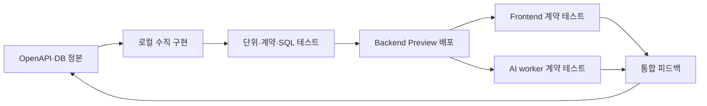

# 마피코 통합 로드맵 — 엄격한 MVP·백엔드 우선

기준일: 2026-09-29  
목표 마감: 2026-12-07  
상태: 팀 내부 실행 기준. 제품 정책의 미결 항목은 확정으로 바꾸지 않되, 사용자가 확정한 **ERD 전체 MVP 포함**과 **백엔드 조기 배포**를 최우선 제약으로 적용한다.

## 1. 목표

마피코 MVP는 축소 데모가 아니라 현재 ERD에 포함된 전체 도메인을 동작 가능한 한 흐름으로 연결한다. 프론트엔드와 AI가 기다리지 않도록 백엔드를 작은 수직 슬라이스로 지속 배포하고, 미완성 의존성은 가짜 성공 대신 명시적인 상태·오류·stub 계약으로 제공한다.

완료의 의미는 다음 네 조건을 모두 만족하는 것이다.

1. ERD의 22개 public 테이블이 개발용 Supabase에 적용되고 RLS·권한·Storage 경계가 검증된다.
2. 각 테이블이 최소 한 개의 제품 흐름, 내부 job 또는 멱등 처리에서 실제로 사용된다.
3. 현재 OpenAPI 50개 operation은 별도 계약 변경으로 제외하지 않는 한 모두 구현·테스트 대상이다.
4. 모바일 웹, Backend, AI worker가 Preview 환경에서 실제 계약으로 통합 테스트할 수 있다.

## 2. 엄격한 MVP 범위

| 도메인 | ERD 구성 | MVP에서 보여야 하는 동작 | 완료 게이트 |
|---|---|---|---|
| 계정·취향 | profiles, aesthetics, tpo_presets, user_aesthetic_preferences | 로그인 사용자 프로필, 5종 카탈로그, 1~3개 선호, 이전 TPO 호환 데이터 | 실제 JWT·RLS 조회/쓰기, 미확정 taxonomy 상태 표시 |
| 의류 등록 | garment_batches, garment_assets, analysis_jobs, garment_drafts, garments, garment_aesthetic_scores | 촬영/앨범→비공개 업로드→AI job→사용자 검토·수정→옷장 확정 | Storage 실파일, job 재시도, 원자 확정, 실패/부분성공 검증 |
| 날씨·추천 | weather_snapshots, recommendation_requests, outfit_recommendations, outfit_items | 대상 시점 날씨와 사용자 취향으로 1~3개 코디 및 설명 생성 | 실제/대체 날씨 정책, AI·템플릿 fallback, 모델·엔진 버전 추적 |
| 보관·착용 | saved_outfits, saved_outfit_items, ootd_entries | 직접/추천 코디 보관, 계획/착용 기록, 캘린더·통계 | snapshot 불변성, 날짜 충돌·wear_status 정책 테스트 |
| 공유·따라입기 | feed_posts, feed_media, post_likes, mimic_requests | 명시적 게시, 공유 이미지, 좋아요 보관, 내 옷 매칭과 부족 아이템 CTA | 비공개→공개 게이트, URL 만료, 가시성 재검사, raw AI 결과 비노출 |
| 공통 신뢰성 | idempotency_keys | 중복 생성 요청의 안전한 재처리 | 요청 hash·응답 재사용·만료·충돌 테스트 |

ERD 전체 포함은 모든 미결 UX를 임의 확정한다는 뜻이 아니다. TPO, 하루 OOTD 수, `wear_status`, 추천 생성 시각 등은 보수적 기본값과 명시적 상태를 사용하고 팀 결정 후 계약·migration을 함께 바꾼다.

## 3. 백엔드 조기 배포 전략

### Preview 원칙

- 개발용 Supabase와 Vercel Preview를 공용 통합 환경으로 사용한다.
- health 200은 런타임만, readiness 200은 정의한 MVP 의존성 준비 완료만 의미한다.
- 미구현 기능은 fixture 성공처럼 위장하지 않고 `planned`, `not_integrated`, 503 또는 명시된 job 상태를 반환한다.
- API 변경은 OpenAPI→코드→테스트→Preview 순서로 배포하며 FE·AI에는 변경 요약과 예시 요청/응답을 함께 전달한다.
- Preview 데이터는 실사용 개인정보가 아닌 합의된 개발용 계정·이미지로 제한한다.
- 프론트와 API origin이 다르면 허용 origin을 고정한 CORS preflight를 먼저 검증한다.
- 공용 개발 DB의 주중 migration은 additive 변경을 원칙으로 한다. 파괴적 변경은 사전 공지·백업·seed 재적용 계획과 함께 별도 시간대에 수행하고 사용자가 적용 이력을 기록한다.
- FE·AI가 안정적으로 참조할 branch alias 또는 고정 도메인을 사용한다. Preview 보호는 팀 접근 허용 또는 공식 bypass 방식 중 하나를 사용자가 결정한다.

### 원격 기반 게이트 D0

다음 항목이 충족되어야 FE·AI가 독립적으로 테스트할 수 있다.

- 사용자가 GitHub private 저장소를 지원하는 플랜, 별도 공개 실습 저장소, Git 연동 없는 직접 CLI Preview 중 배포 방식을 결정한다.
- 개발용 Supabase 대상과 기존 schema 유무를 확인한다.
- 3개 migration을 순서대로 적용하고 적용 파일·시각·대상을 기록한다.
- Vercel Preview에 `SUPABASE_URL`, `SUPABASE_PUBLISHABLE_KEY`를 설정한다. R2 이전에는 서버 전용 `SUPABASE_SECRET_KEY`, `AI_CALLBACK_HMAC_SECRET`, 허용 origin 설정도 값 노출 없이 등록 여부를 확인한다.
- 고정 branch alias/도메인과 Deployment Protection 또는 공식 bypass 방식을 정하고 새 Preview를 배포한다.
- Supabase 개발 테스트 사용자와 사용 허용이 확인된 이미지 세트를 준비한다. R0의 Auth/RLS 검증은 Kakao 준비 전에도 가능한 개발용 로그인 방식으로 수행하고 Kakao E2E는 R1에서 닫는다.
- `/api/health`, `/api/aesthetics`, 인증된 `/api/v1/me`를 실환경에서 확인한다.
- Frontend Preview origin, AI callback/worker origin과 필요한 인증 방식을 등록한다.

## 4. 단계별 일정과 게이트

시험·디자인 일정을 고려한 내부 목표이며 팀 가용시간이 바뀌면 날짜보다 게이트를 우선한다. 시험 주간에는 신규 UI 완료를 전제하지 않고 API client·fixture·BE 스크립트 기반 consumer test와 회귀검증을 우선한다. 엄격한 범위와 12/7 마감을 동시에 지키는 일정은 고위험이며, D0 지연이나 담당자 병렬 투입 부족 시 즉시 재계획한다.

| 단계 | 목표 기간·용량 | G 매핑 | 대상 operationId·누적 수 | Backend·데이터 / FE·AI | 종료 게이트 |
|---|---|---|---|---|---|
| R0 기준선·배포 | 9/29~10/5 | 기반 | 기존 `getMe` / 1 | D0, Auth/RLS 실검증, CORS, 공용 오류 envelope / FE client 골격·AI fixture | 세 팀이 고정 Preview에서 health/catalog/me 호출 |
| R1 계정·온보딩 | 10/6~10/19, 10/6~12 시험은 저용량 | G1 | `updateMe`, `replaceAestheticPreferences`, `listAesthetics`, `listTpoPresets`, `saveOnboardingState` / 6 | narrow write 권한·호환 TPO read / API client·fixture 소비, Kakao E2E 준비 | 계정→선호 저장→재조회 스크립트 E2E; 실제 UI는 후속 |
| R2 옷장 조회·업로드 | 10/13~10/31, 10/20~26 시험은 회귀 중심 | G2·G3 | `list/get/update/deleteGarment`, `create/getGarmentBatch`, `refreshUploadUrl`, `completeGarmentUpload` / 14 | signed upload·Storage 검증 / 옷장 contract·AI 입력 schema | 실제 이미지 업로드·소유권 차단, taxonomy v1·평가셋 v0, 내부 AI job 계약 확정 |
| R3 AI 등록 파이프라인 | 10/27~11/9 | G4 | `create/get/retryAnalysisJob`, `listGarmentDrafts`, `updateGarmentDraft`, `confirmGarmentBatch`, `receiveAnalysisResult` / 21 | worker callback·draft·원자 확정 / Vision baseline·검토 client | 2~6벌→draft→수정→확정 E2E와 데이터/model version 평가 리포트 |
| R4 추천·보관·OOTD | 11/3~11/16 | G5·G6 | weather 1, recommendation 3, saved outfit 5, OOTD 5, statistics 1 / 36 | 날씨·추천·보관·착용 / 홈·보관함·캘린더 UI와 추천·설명 | 추천→보관/착용 UI E2E, 추천 평가·fallback 리포트 |
| R5 피드·따라입기 | 11/10~11/23, 11/17~23 시험은 회귀 중심 | G7·G8 | feed/media/like 11, mimic 2 / 49 | 가시성·media·matching / 피드·따라입기 consumer | 게시→좋아요→따라입기→보관 E2E; 외부 AI 전송·학습 후보 삭제 검증 |
| R6 전체 통합·정리 | 11/24~11/30 | G9·G10 | `requestAccountDeletion` / 50 | 탈퇴·Storage/파생 정리, idempotency, coverage / 모바일 실기기·실패 UI | 50 operation·22테이블 coverage, 삭제·회귀 테스트 통과 |
| R7 동결·QA | 12/1~12/6 | G10 | 50 유지 | 성능·보안·복구·관측, 배포 고정 / 시연 데이터·발표·접근성 | 필수 시연 2회 연속 성공, 치명 결함 0 |
| 제출 | 12/7 | 종료 | 50 유지 | 제출 태그·문서·배포 URL / 발표·시연 | 재현 가능한 제출본 |
| 유지보수 | 12/8~12/13, 시험 주간 | 유지 | 신규 범위 금지 | 차단 결함과 문서만 보완 | 변경 이력과 회귀검증 |

단계가 일부 겹치는 것은 독립 모듈의 병렬 작성과 조기 계약 테스트를 위한 것이다. 동일 파일·공통 인증 모듈·migration은 단일 작성자가 순차 통합하며, 한 명의 BE 담당만으로 병렬성이 확보되지 않으면 겹치는 단계의 종료일을 즉시 재조정한다.

### 50 operation 단계 배정

- R0(누적 1): `getMe`.
- R1(+5, 누적 6): `updateMe`, `replaceAestheticPreferences`, `listAesthetics`, `listTpoPresets`, `saveOnboardingState`.
- R2(+8, 누적 14): `listGarments`, `getGarment`, `updateGarment`, `deleteGarment`, `createGarmentBatch`, `getGarmentBatch`, `refreshUploadUrl`, `completeGarmentUpload`.
- R3(+7, 누적 21): `createAnalysisJob`, `getAnalysisJob`, `retryAnalysisJob`, `listGarmentDrafts`, `updateGarmentDraft`, `confirmGarmentBatch`, `receiveAnalysisResult`.
- R4(+15, 누적 36): `getCurrentWeather`, `createRecommendation`, `getRecommendation`, `acceptRecommendation`, `listSavedOutfits`, `createSavedOutfit`, `getSavedOutfit`, `updateSavedOutfit`, `deleteSavedOutfit`, `listOotdEntries`, `createManualOotd`, `getOotd`, `updateOotdEntry`, `deleteOotdEntry`, `getClosetStatistics`.
- R5(+13, 누적 49): `listFeed`, `createFeedPost`, `getFeedPost`, `updateFeedPost`, `deleteFeedPost`, `createFeedMediaUpload`, `completeFeedMedia`, `likeFeedPost`, `unlikeFeedPost`, `listLikedPosts`, `listMyPosts`, `createMimicJob`, `getMimicJob`.
- R6(+1, 누적 50): `requestAccountDeletion`.

operation 이름은 OpenAPI `operationId`를 그대로 사용한다. 계약 변경으로 추가·제외되면 누적 수와 ERD coverage를 같은 변경에서 갱신한다.

## 5. 병렬 트랙

### Backend 트랙

인증/공통 HTTP → 계정/온보딩 → 의류 조회 → Storage/Job → 추천/보관/OOTD → 피드/따라입기 → 탈퇴/정리 순서로 진행한다. 각 수직 슬라이스는 구현 상태를 operation 단위로 기록한다.

### AI 트랙

최종 5종 정의와 평가셋을 먼저 고정하고, 등록 Vision·추구미 점수·추천·설명·따라입기를 동일한 job/버전 계약으로 연결한다. 모델이 준비되지 않은 단계에서는 `source` 또는 `engine_version=fixture-*`처럼 응답에서 fixture를 식별하고 실제 추론으로 표시하지 않는다. 등록 Vision 실패에는 단건 등록·수동 카테고리, 추천/설명 실패에는 규칙·템플릿 fallback을 둔다. 외부 Vision/LLM 전송 동의·보존·학습 후보 삭제를 검증한다.

### Frontend·디자인 트랙

유저플로우→와이어프레임→디자인을 진행하되 API fixture와 Preview를 조기에 사용한다. Figma/Miro 화면과 로컬 Mermaid의 노드 ID·기능 ID를 연결해 변경 추적이 가능해야 한다.

### 데이터·QA 트랙

개발용 계정·허용 이미지·taxonomy version·모델 version을 기록한다. RLS/Storage/가시성/삭제/멱등성은 기능 완료 뒤가 아니라 각 단계의 필수 테스트다.

## 6. 목표 관리 루틴

모든 다음 작업은 하나의 bounded goal로 실행한다.

1. Scope: 대상 operation·테이블·사용자 흐름·금지 범위를 고정한다.
2. Contract: OpenAPI, SQL/RLS, AI DTO, FE 소비 형태를 대조한다.
3. Implement: 작은 수직 슬라이스로 코드와 테스트를 작성한다.
4. Verify: 로컬 단위/계약/SQL → Preview smoke → FE/AI consumer 검증 순서로 확인한다.
5. Report: 계획, 실행 로그, 결과, 미검증 위험, 다음 gate를 문서화한다.
6. Close: 정본/export 동기화와 파일 소유권 해제 뒤 goal을 완료한다.

## 7. 아직 필요한 사용자·팀 결정

- 최종 추구미 5종 이름·정의·대표/제외 이미지
- TPO 추천 반영 여부와 사용자 입력 방식
- 하루 여러 OOTD 여부와 `wear_status` UX
- 개발 Preview의 허용 사용자·이미지·보존 기간
- Kakao 개발자 앱·redirect URI·테스트 사용자
- 시연 시 반드시 성공해야 할 대표 흐름과 fallback 허용 범위
