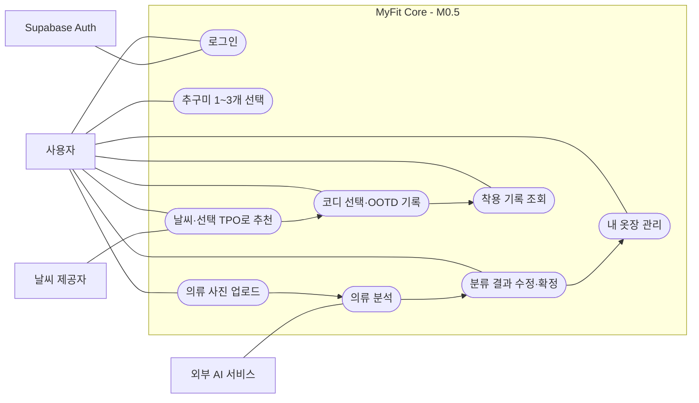
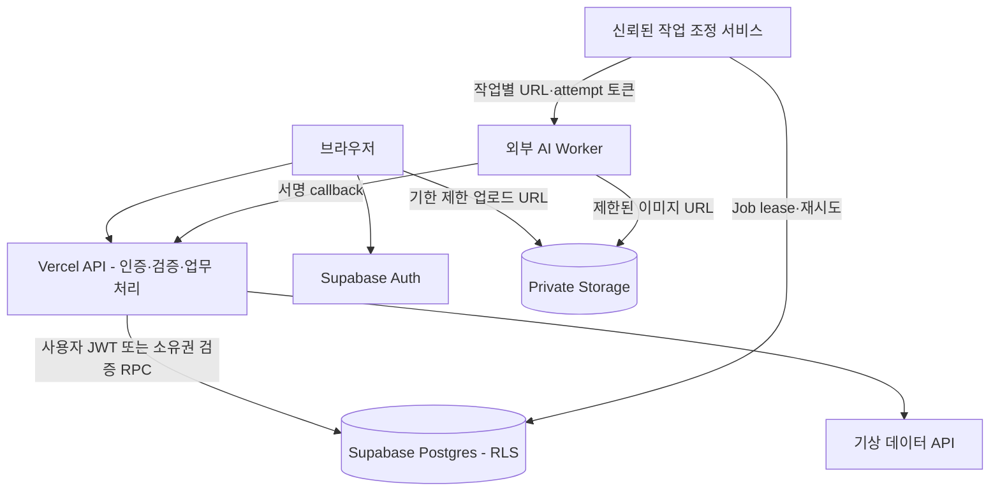
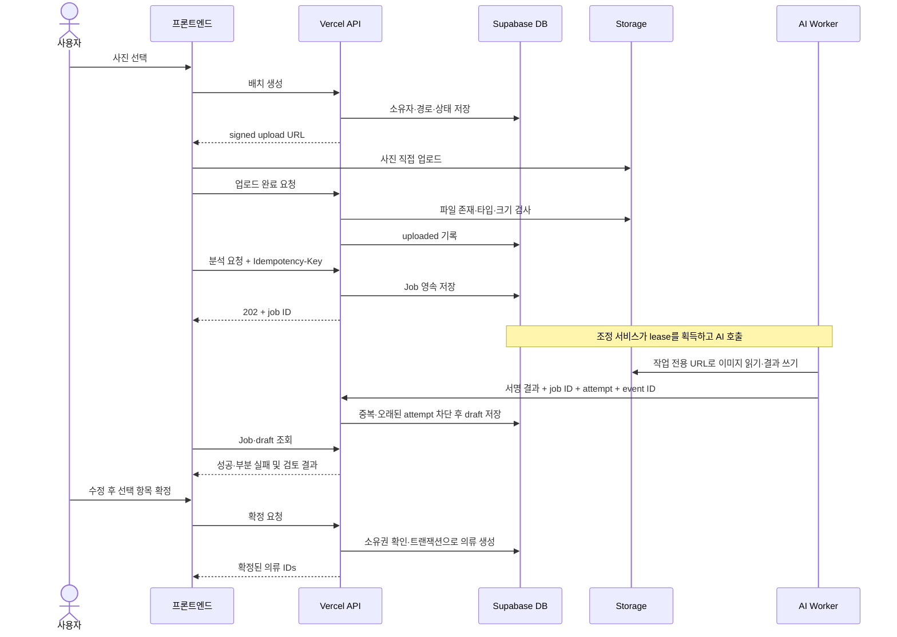
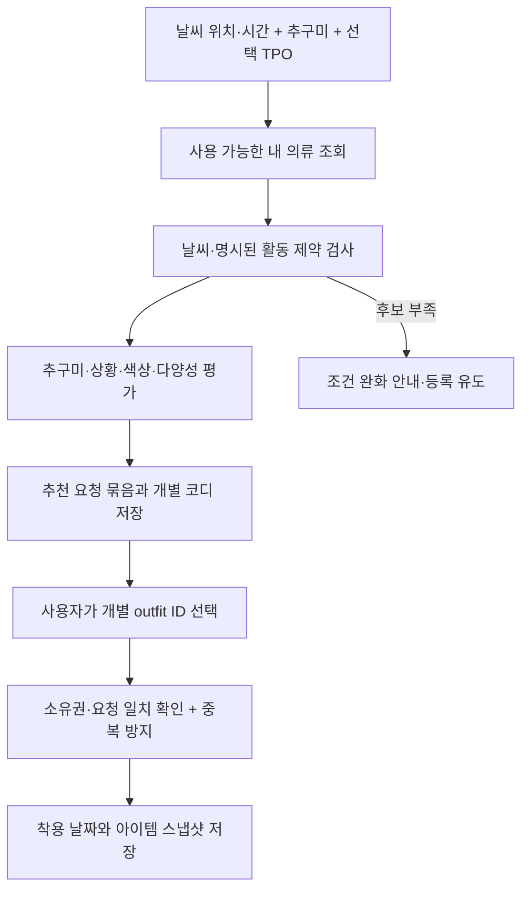

# MyFit:Core 설계 다이어그램

상태: M0.5 구현 계약을 위한 설계. 실제 서버 배포를 나타내지 않습니다.
ERD, 유스케이스, 등록 시퀀스는 지금 필요합니다. 화면별 클래스도와 상세 배포 토폴로지는 프레임워크·AI 실행 환경 확정 후 추가합니다.
각 Mermaid 블록은 Mermaid 지원 뷰어에서 렌더링하거나 소스로 내보낼 수 있습니다.

## 사용자 유스케이스

Mermaid flowchart로 표현한 유스케이스 관계도입니다. 정식 UML 표기와는 구분합니다.

소셜 게시·댓글·실사용자 OOTD 따라입기는 후속 범위입니다. 추가 테이블을 지금 강제하지 않습니다.

## 시스템 책임

## 다중 등록 시퀀스

## 추천과 OOTD

후보가 부족하면 3개를 강제 생성하지 않습니다. 추천 개수와 부족 사유를 반환합니다. TPO 미선택은 상황 제약을 적용하지 않으며 자동으로 등교·출근을 가정하지 않습니다.
