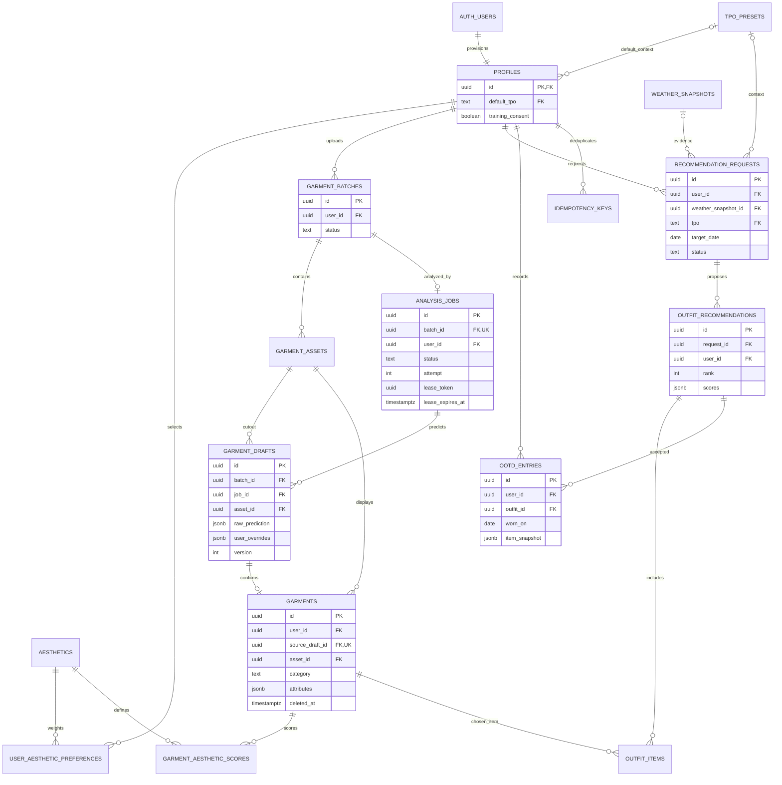

# MyFit:Core M0.5 ERD

물리 스키마 정본은 `supabase/migrations/*.sql`, 필드·접근권한 상세는 `DB_DESIGN.md`입니다. 관계선은 주요 업무 관계이며 여러 소유권 검사용 복합 FK는 읽기 쉽게 생략했습니다.

## 읽는 순서

1. 계정이 생성되면 profiles가 생기고 선택한 추구미의 가중치를 저장합니다.
2. 사진 하나는 batch로 등록되고 원본/누끼는 assets로 관리합니다.
3. Job의 예측은 drafts에 보관하며 사용자 수정값을 별도로 유지합니다.
4. 확정한 draft만 garments가 됩니다. source_draft_id의 고유 제약으로 중복 생성을 막습니다.
5. 추천 요청 한 건은 최대 3개 outfit을 가지며 각 outfit은 여러 내 의류를 참조합니다.
6. 사용자가 선택한 outfit과 착용 날짜를 OOTD에 남깁니다.

자식 행의 `(user_id, 부모_id)` 복합 FK로 소유자 일치를 보장합니다. Job/draft는 추가로 같은 batch인지 검사합니다. RLS는 행 조회 범위를 제한하고 서버 계산 필드의 직접 수정 권한은 부여하지 않습니다.

## 다음 단계로 남긴 테이블

공개 피드·댓글·스크랩·Mimic·벡터 인덱스는 이 초기 DB에 포함하지 않았습니다. 임베딩 모델과 차원이 확정되지 않아 pgvector 차원을 임의로 정하지 않았습니다. DB를 연결하는 즉시 이 기능들이 생기는 것은 아닙니다.
