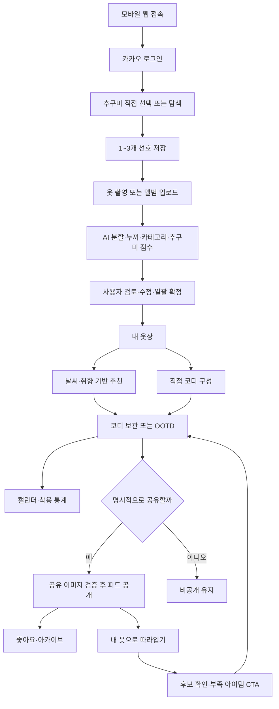
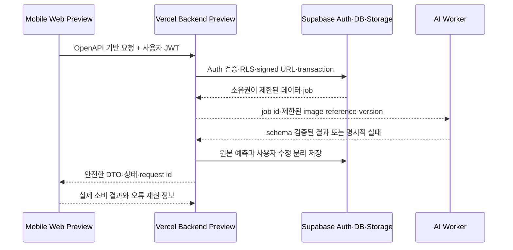
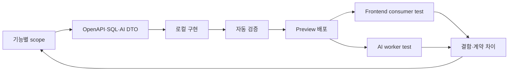

# 마피코 다이어그램 시작자료

기준일: 2026-09-29. 로컬 Mermaid를 검토 가능한 정본으로 유지하고, 연결된 협업 도구에서는 같은 구조를 네이티브 도형으로 변환한다.

## 1. 도구 선택

- LobeHub는 MCP 호환 플러그인과 에이전트를 운영하는 플랫폼이며, 이 프로젝트의 다이어그램 파일 형식 자체는 아니다.
- 현재 작업에 가장 직접적인 협업 도구 후보는 Miro다. 유저플로우·시퀀스·아키텍처·로드맵을 네이티브 객체로 만들고 팀이 수정·댓글을 남길 수 있다.
- Miro 연결 여부와 무관하게 본 문서와 `USER_FLOWS.md`, `ERD.md`, `AI_ARCHITECTURE.md`의 Mermaid가 source of truth다.
- 외부 보드에는 비밀키·실제 사용자 데이터·비공개 Storage 경로를 넣지 않는다.

## 2. 보드 프레임 구조

1. `00 범례·상태`: 확정/제안/미결/미구현 색상과 기능 ID 범례
2. `01 전체 사용자 여정`: 로그인부터 따라입기까지의 화면 흐름
3. `02 등록 시퀀스`: Web–BFF–Storage–AI worker–DB
4. `03 추천·OOTD`: 날씨·취향·옷장→추천→보관/착용
5. `04 피드·따라입기`: 공개 경계와 개인 데이터 projection
6. `05 백엔드 조기 배포`: 로컬→Preview→FE/AI 피드백 루프
7. `06 ERD coverage`: 22테이블을 사용자 흐름과 테스트 gate에 연결
8. `07 미결 결정`: TPO, OOTD 수, taxonomy, 시연 fallback

## 3. 전체 MVP 사용자 여정

## 4. Backend–Frontend–AI 통합 흐름

## 5. 조기 배포와 피드백 루프

## 6. Miro 변환용 요청문

Miro가 연결되면 아래 지시를 사용한다.

> `deliverables/design/DIAGRAM_STARTER.md`, `USER_FLOWS.md`, `deliverables/backend/ERD.md`, `AI_ARCHITECTURE.md`를 기준으로 마피코 협업 보드를 만든다. 프레임은 00~07 구조를 유지하고, 기능 ID와 ERD 테이블명을 원문 그대로 보존한다. 확정은 파랑, 제안은 노랑, 미결은 주황, 미구현은 회색으로 표시한다. 현재 상태는 최신 operation·ERD coverage 보고를 기준으로 표시하고 구현 완료를 추정하지 않는다. 비밀값·실제 사용자 데이터·Storage 원본 경로는 포함하지 않는다.

## 7. 변경 규칙

- 보드에서 결정된 내용은 PRD 또는 결정 기록에 반영된 뒤 정본으로 인정한다.
- 보드만 바뀌고 로컬 정본이 바뀌지 않은 상태를 제품 결정으로 간주하지 않는다.
- 흐름 노드에는 가능한 경우 PRD 기능 ID, OpenAPI operationId, ERD 테이블명을 함께 기록한다.
