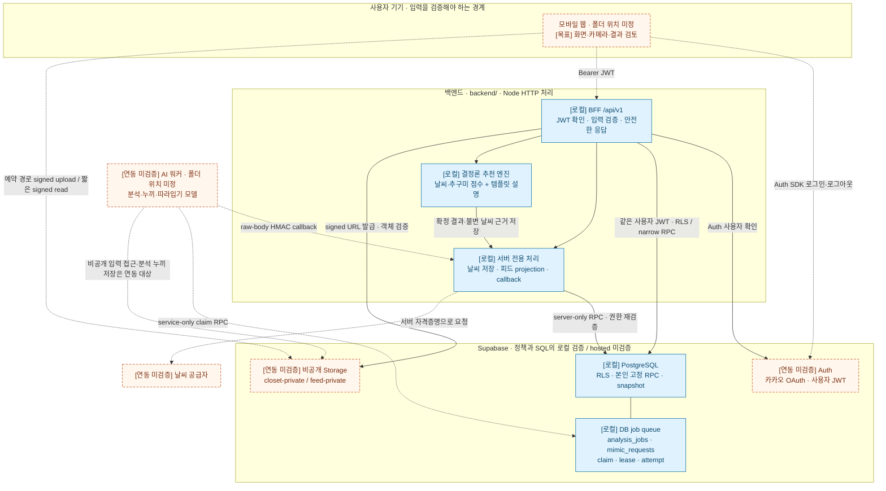
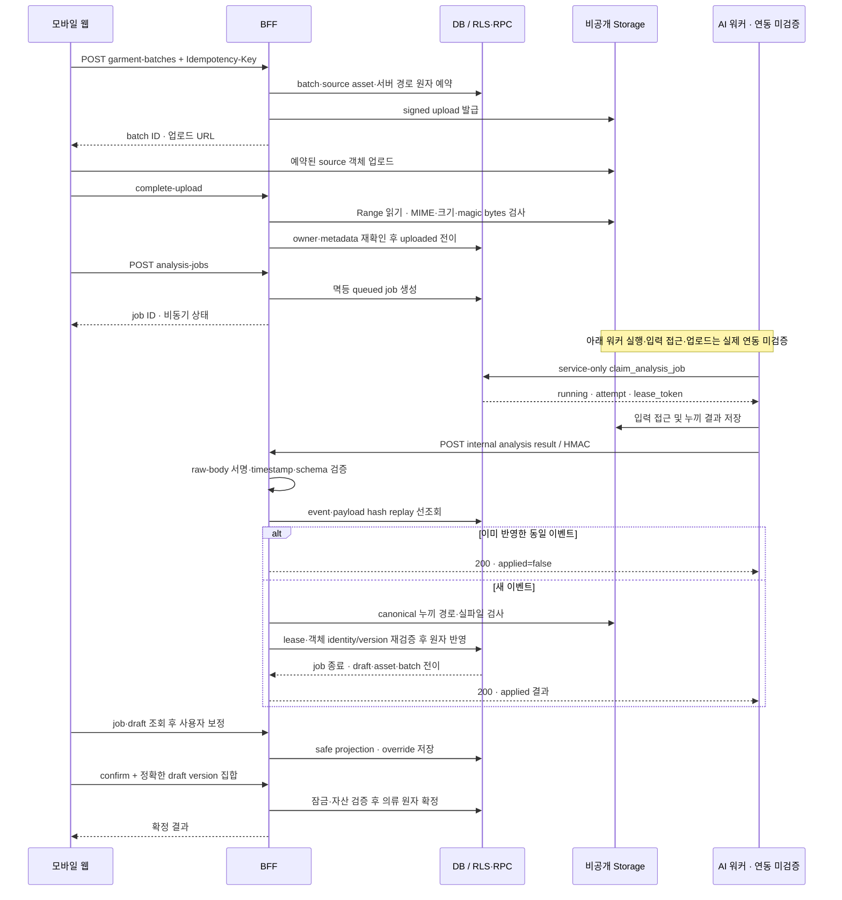
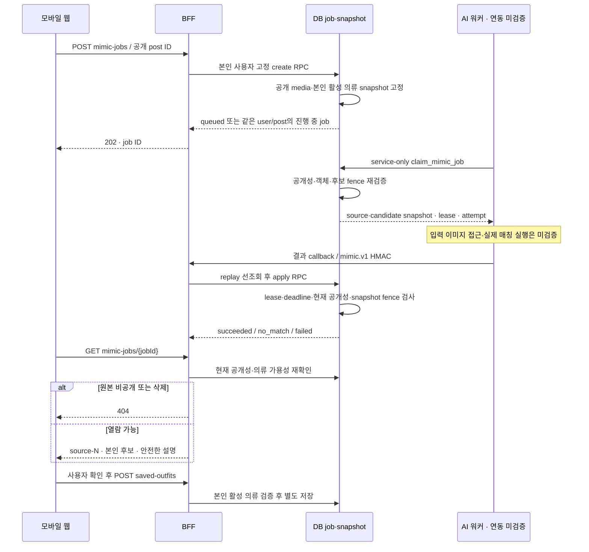
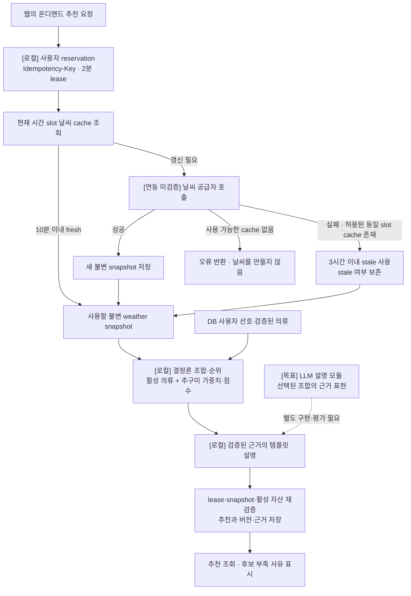

# 마피코 시스템 아키텍처

2026-10-02 저장소 확인 기준. 모바일 웹 우선 방향은 사용자 채팅에서 정했으며 네이티브 앱·PWA 출시는 확정하지 않았다. 이 문서는 코드와 계약의 연결을 설명하는 검토본이며 배포 완료 그림이 아니다.

현재 G1~G8의 OpenAPI operation 49/50은 `implemented-local`이다. 탈퇴 요청은 `planned`이며 실제 AI 워커, hosted Supabase Auth·Storage·RPC 및 날씨 공급자 연동은 미검증이다. 로컬 테스트는 Auth/Storage 스텁과 embedded PostgreSQL을 포함한다. 22개 테이블의 원래 MVP 범위에 G8 snapshot 2개가 추가되어 현재 migration에는 public 테이블 24개가 있다.

## 1. 구성과 신뢰 경계

실선은 현재 서버 코드·SQL에 있는 호출 계약, 점선은 제품 클라이언트 또는 외부 연동이 필요한 경로다. 선이 존재해도 hosted 통과를 뜻하지 않는다. `[로컬]`, `[연동 미검증]`, `[목표]` 표기는 색상과 함께 읽는다.

BFF는 모바일 웹용 API 계층이다. 일반 사용자 요청은 Supabase Auth의 `/auth/v1/user`로 확인한 JWT를 RLS 조회·RPC에 그대로 전달한다. 공개 카탈로그는 publishable key로 허용 필드만 익명 조회한다. 서버 전용 키를 쓰는 날씨·피드·callback 경로는 별도로 검증하며, service role이 RLS를 우회하므로 사용자 범위를 다시 확인해야 한다. 비밀값은 브라우저에 전달하지 않는다.

Storage URL은 접근 수단이며 영구 공개 전환이 아니다. URL 자체에는 경로가 포함될 수 있지만 raw object key를 별도 응답 필드로 제공하지 않는다. 피드에는 `feed-private`의 공유 전용 복사본만 사용하고 개인 옷장 원본을 공개하지 않는다. 비공개 전환·철회 뒤 신규 URL 발급은 막지만 이미 발급한 URL은 만료까지 유효할 수 있다.

근거: [API 설계](../../backend/docs/API_DESIGN.md), [DB 설계](../../backend/docs/DB_DESIGN.md), [백엔드 README](../../backend/README.md), [현재 저장소 구조](../../README.md). 현재 루트 README는 프론트엔드·AI 팀이 작업 시작 시 폴더 구조를 정하도록 하므로 경로를 확정하지 않는다.

## 2. 등록 → 비동기 분석 → 사용자 확정

아래는 구현된 서버 계약과 아직 연결하지 않은 워커를 함께 보여주는 시퀀스다. HTTP 요청이 AI 추론 종료까지 대기하지 않고, 웹은 job을 조회한다. 별도 Redis·메시지 브로커 도입은 이 구현에서 확인되지 않는다.

모델 원본 예측과 사용자 수정값은 분리하며 일반 draft 응답에 raw 예측을 노출하지 않는다. callback은 5분 timestamp 창과 HMAC을 확인한다. 동일 이벤트 replay는 변경 가능한 lease·Storage 검사보다 먼저 처리한다. 분석 claim은 만료된 lease를 재획득할 수 있으며 재시도 한도를 넘으면 실패 처리한다. 실패 결과는 안전한 상태로 조회하고 허용된 오류만 사용자 retry API로 재시도한다.

근거: [G4 결과](../../backend/worklogs/2026-10-01_G4_ANALYSIS_RESULT.md), [분석 claim SQL](../../backend/supabase/migrations/202609270002_transactions.sql), [분석 확정 SQL](../../backend/supabase/migrations/202610010001_analysis.sql), [분석 callback](../../backend/lib/analysis-callback.js).

## 3. 피드 따라입기: snapshot과 현재 권한을 함께 확인

DB queue는 사용자 진행 중 job 최대 3개, 2시간 deadline, 최대 3회 lease attempt, 종료 후 7일 결과 보존을 적용한다. similarity는 일치 확률이 아니다. 일부 매칭도 `succeeded`가 될 수 있고, 완료 뒤 후보가 모두 사용 불가해지면 조회 projection이 `no_match`가 된다. callback에는 분석과 다른 `mimic.v1` HMAC domain을 사용한다. 결과 조회가 보관함 저장을 자동으로 수행하지 않는다.

근거: [G8 결과](../../backend/worklogs/2026-10-01_G8_MIMIC_RESULT.md), [따라입기 SQL](../../backend/supabase/migrations/202610010005_mimic.sql), [따라입기 callback](../../backend/lib/mimic-callback.js), [G7 피드 결과](../../backend/worklogs/2026-10-01_G7_FEED_RESULT.md).

## 4. 현재 추천 경로와 AI 목표의 구분

현재 추천은 AI 워커 job이 아니라 BFF의 결정론 엔진이며 자유 형식 LLM을 호출하지 않는다. 목표 구조에서는 Vision, 5종 추구미 추론, 추천 결정, 설명 생성을 분리한다. 5종 개수만 확정됐고 이름·정의·학습 성능은 미확정이다. 남성용 스타일 확장은 후속 선택사항이다. TPO 유지 여부와 5시/7시 생성 정책은 미결이므로 이 그림에 필수 입력이나 확정 스케줄을 넣지 않았다.

근거: [G5 결과](../../backend/worklogs/2026-10-01_G5_RECOMMENDATION_RESULT.md), [추천 코드](../../backend/lib/recommendations.js), [날씨 코드](../../backend/lib/weather.js), [AI 목표 설계](../../backend/docs/AI_ARCHITECTURE.md), [PRD](../../backend/docs/product/PRD.md).

## 검토 시 남겨둘 경계

| 구분 | 확인된 범위 | 남은 검증·결정 |
|---|---|---|
| 인증·데이터 | JWT 전달, RLS·RPC, 소유권·멱등성 로컬 구현 | 실제 카카오 로그인, hosted Auth/RLS·동시 요청 |
| 이미지 | 비공개 bucket 계약, 실파일·객체 version 검증 코드 | hosted signed upload/read·만료·삭제 cleanup 워커 |
| 분석·따라입기 | DB queue·claim·lease·HMAC callback·safe projection | 워커 실행, 입력 전달·Storage 접근, 실제 추론·평가 |
| 추천 | 결정론 엔진·불변 날씨 snapshot·템플릿 설명 | 실제 공급자, 시간대 자정 E2E, LLM 설명 구현 |
| 보관·OOTD·피드 | 별도 데이터·사용자 저장·명시적 공개 경계 | 하루 OOTD 수·wear_status UX·피드 추구미 수 최종 결정 |
| 탈퇴 | OpenAPI 계약 | 요청 구현·재인증·DB/Storage·공유 데이터 정리 |

보관함 수정은 과거 OOTD snapshot을 바꾸지 않는다. OOTD 자체는 비공개이며 피드 게시를 별도 수행한다. 현재 하루 1기록 제약과 `planned/worn` 처리는 로컬 기술 계약이지 미결 제품 정책의 최종 승인으로 읽지 않는다. [G6 결과](../../backend/worklogs/2026-10-01_G6_OUTFIT_OOTD_RESULT.md)와 [결정 기록](../../backend/records/decisions/DECISIONS.md)을 함께 확인한다.

이 문서 작성 시 서버 테스트를 재실행하지 않았다. 기존 G8 결과의 테스트 통과 기록과 현재 파일을 대조했으며 Mermaid 렌더링·통합 검증은 시각자료 통합 단계에서 수행한다.
