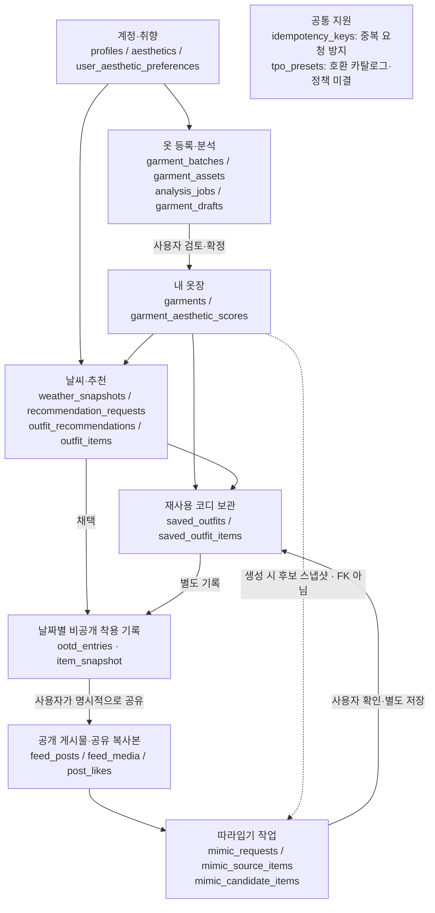
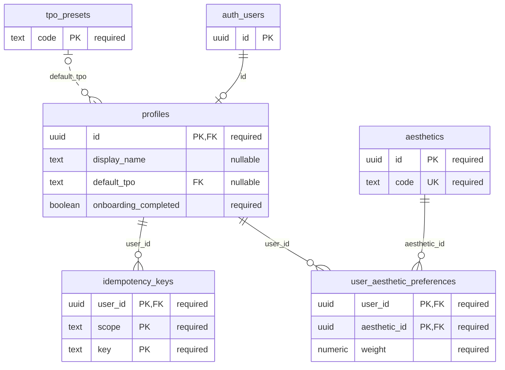
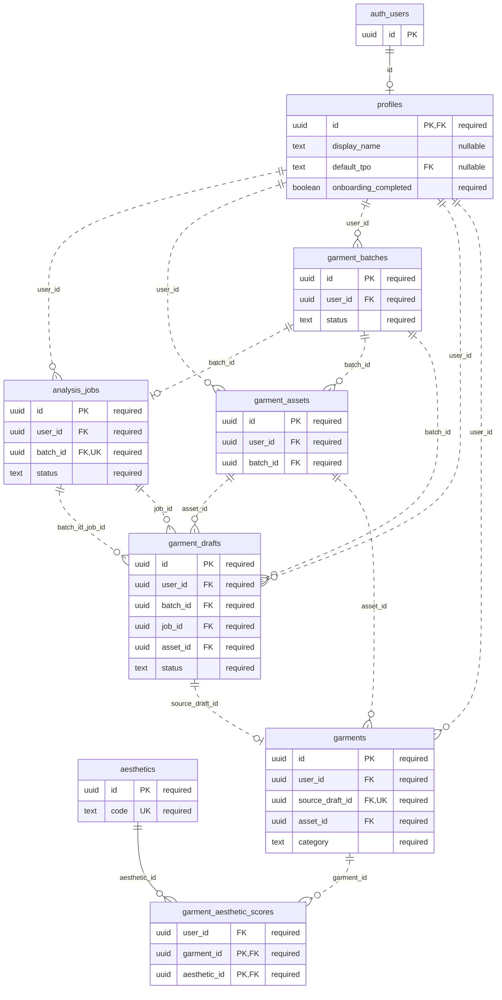
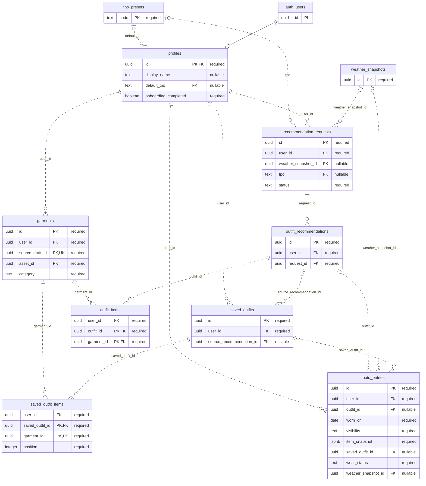
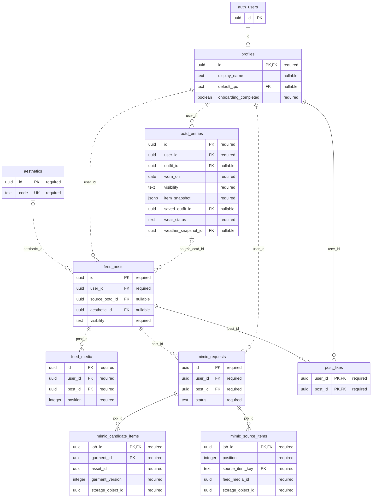

# DB 흐름과 상세 ERD

2026-10-02 팀 검토본. 현재 migration 12개를 일회용 PGlite에 적용해 **public 테이블 24개**의 실제 컬럼·PK·FK·UNIQUE를 조회했다. 원격 DB는 접근하지 않았고 Auth/Storage는 로컬 스텁이다.

도메인 요약도의 화살표는 업무 흐름이며 FK가 아니다. 상세 ERD는 실제 FK만 표시하며, 읽기 쉽게 PK·FK와 주요 업무 필드만 보여준다. 겹치는 테이블은 같은 테이블의 재표시다. 전체 컬럼·제약은 [migration](../../backend/supabase/migrations/)과 [DB 설계](../../backend/docs/DB_DESIGN.md)가 기준이다.

## 1. 데이터가 이어지는 흐름

## ERD 범례

- PK: 기본 키, FK: 외래 키, UK: 유일 키. 복합 키는 여러 컬럼이 함께 구성한다.
- 관계 끝의 한 줄은 1, 원은 0 허용, 갈퀴는 여러 행을 뜻한다. 컬럼 주석 nullable은 NULL 허용이다.
- 실선은 FK 컬럼이 자식 PK에 포함되는 식별 관계, 점선은 비식별 FK다. **점선도 실제 FK**이며 논리적 추정 관계라는 뜻이 아니다.
- FK의 NULL 허용과 UNIQUE/PK 제약을 기준으로 관계 수를 도출한다. 부분 unique index 및 RPC의 추가 업무 제약은 관계 수에 모두 표현하지 않는다.
- profiles와 auth_users는 같은 ID를 쓰며 auth_users는 외부 auth.users 표시용 이름이다. 24개 public 테이블 집계에는 넣지 않는다.

## 2. 계정·취향·중복 요청

## 3. 옷 등록·분석·확정

## 4. 추천·보관함·착용 기록

## 5. 피드·좋아요·따라입기

## 관계를 읽을 때 주의할 점

1. mimic_source_items.feed_media_id와 mimic_candidate_items.garment_id·asset_id는 저장된 식별자지만 **실제 FK가 아니다**. 두 테이블의 job_id만 mimic_requests를 참조한다. 공개성·자산 변경·후보 유효성은 RPC가 스냅샷과 현재 상태를 대조한다. 기존 ERD의 이 부분은 논리 참조와 FK가 섞여 있어 이번 공유본에서 바로잡았다.
2. ootd_entries.item_snapshot은 기록 당시 의류를 담는 JSON이다. garments를 직접 가리키는 항목별 FK 테이블이 아니다. saved_outfit_id와 outfit_id는 둘 다 NULL일 수 있고 동시에 지정할 수는 없다.
3. 사용자 소유권은 여러 관계에서 (user_id, id) 복합 FK로 확인한다. 실제 컬럼을 생략한 단순 ID 관계로 바꾸지 않았다.
4. 원본·누끼는 garment_assets, 공유 이미지는 feed_media로 분리한다. Storage 객체의 ID/경로를 갖는 것과 storage.objects에 FK가 있는 것은 다르다. DB 행 삭제가 Storage 파일 삭제를 자동 보장하지 않는다.
5. 하루 OOTD 수, wear_status, TPO 제품 정책과 최종 추구미 명칭은 DB의 현재 제약과 별개로 미결 상태를 유지한다.

[기존 ERD](../../backend/docs/ERD.md) · [DB 설계](../../backend/docs/DB_DESIGN.md) · [시스템 아키텍처](ARCHITECTURE.md). 기존 백엔드 문서와 SQL은 이 작업에서 수정하지 않았다.
