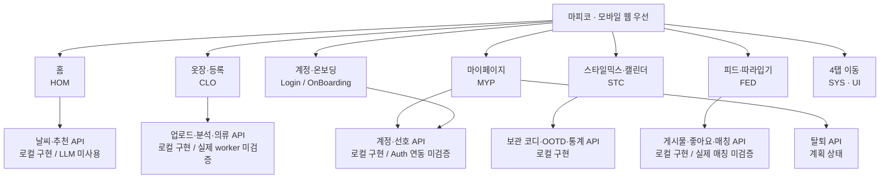

# 기능맵 · 요구사항에서 API까지

검토 기준: 2026-10-02. [PRD](../../backend/docs/product/PRD.md)의 기능 ID 32개를 화면·도메인과 [OpenAPI 정본](../../backend/docs/openapi.yaml)에 연결한다. 화면 이름은 기능을 묶기 위한 구분이며 와이어프레임 확정이나 FE 구현 완료를 뜻하지 않는다.

[구현 레지스트리](../../backend/coverage/implementation.json)에는 `implemented-local` 49개가 있고, OpenAPI에는 총 50개 operation이 있다. 나머지 `requestAccountDeletion`은 OpenAPI의 `planned`이며 레지스트리에 구현 항목이 없다. **49/50은 백엔드 operation의 로컬 구현 상태다. 제품 기능 49/50 완료, FE 완료, 실제 AI 추론 완료 또는 배포 완료로 읽지 않는다.**

## 한눈에 보는 기능 영역

## 읽는 법

- **L**: 해당 operation의 레지스트리 상태가 `implemented-local`. HTTP·DB 로컬 구현 근거이며 사용자 기능 전체의 완료 표시는 아니다.
- **P**: OpenAPI에 계약이 있으나 `planned`. 이 문서에서는 계정 삭제 한 개다.
- **UI/외부**: 화면 동작 또는 외부 Auth 흐름으로, 대응하는 자체 OpenAPI operation을 억지로 배정하지 않는다.
- **계약 공백**: 요구사항에 있는 동작을 현재 OpenAPI에서 찾을 수 없음. 기능 제외 결정이 아니다.

아래 표의 operation은 P 표시 한 개를 제외하고 모두 L이다. 직접 기능을 수행하는 API와 저장·조회만 지원하는 API를 설명에서 구분한다. 전체 hosted Auth·Storage·PostgREST 및 실제 worker 통합은 미검증이다.

## PRD 기능 추적표

| 기능 ID | 화면·도메인 / 요구사항 | 연결 operationId | 상태와 검토 경계 |
|---|---|---|---|
| Login-001 | 로그인 / 카카오 가입·로그인 | 자체 로그인 operation 없음. 로그인 이후 프로필 조회에 `getMe` | UI/외부 Auth + 조회 L. `getMe`가 카카오 인증을 수행하지 않음. 실제 Kakao Auth 연동 미검증 |
| OnBoarding-001 | 온보딩 / 추구미 인지 여부 분기 | `saveOnboardingState` | L + UI. 인지 상태 저장과 분기 화면은 별개 |
| OnBoarding-002 | 추구미 선택 / 5종 중 1~3개 | `listAesthetics`, `replaceAestheticPreferences` | L. 최종 5종 이름·정의와 1순위/보조 표현 방식 미결 |
| OnBoarding-003 | 추구미 탐색 / 룩 이미지 선택·제안·재선택 | 확정한 선택 저장에 `replaceAestheticPreferences`; 이미지 점수·제안 operation 없음 | 저장 L + 계약 공백. 이미지 수·점수·가중치·유사도 AI 확인 필요 |
| OnBoarding-004 | 촬영 안내 / 홈 이동·나중 등록 | `saveOnboardingState` | L + UI. 튜토리얼·완료 상태 저장; 실제 촬영을 완료 조건으로 강제하지 않는 방향 |
| HOM-001 | 홈 / 프로필에서 마이페이지 이동 | 이동 자체는 없음. 프로필 표시 데이터는 `getMe` | UI + 조회 L |
| HOM-002 | 홈 / 위치 기반 날씨 위젯 | `getCurrentWeather` | L. 위치 권한 요청은 브라우저 UI. 거절·provider 실패 UX는 별도 검토 |
| HOM-003 | 홈 / TPO 칩 대신 추구미 태그 | `getMe`, `listAesthetics` | L + UI. 홈 태그 수 2~3개와 계정 선택 1~3개 표현 정합성 검토. TPO 추천 로직 제외 여부 미결 |
| HOM-004 | 홈 / 보유 의류 코디 1~3종·설명 | `createRecommendation`, `getRecommendation` | L. 현재 결정론 추천 + fact 기반 template 설명. PRD의 자유 형식 LLM 구현 완료 아님. TPO·생성 시각 5시/7시·갱신 조건 미결 |
| HOM-005 | 추천 상세 / 보관·오늘 입기·스타일믹스 전달 | 명시적 보관에 `createSavedOutfit`; 오늘 입기 확정에 `acceptRecommendation` | L + UI. 화면 이동만으로 저장 호출하지 않음; 저장 시점 구분 |
| SYS-001 | 공통 탐색 / 홈·옷장·스타일믹스/캘린더·피드 4탭 | 없음 | UI. 모바일 웹 우선은 사용자 채팅 근거; 네이티브/PWA 확정 아님 |
| CLO-001 | 옷장 / 전체·카테고리 조회 | `listGarments` | L. 카테고리·하위 분류 표시 UX는 별도 |
| CLO-002 | 등록 / 카메라·앨범 업로드 | `createGarmentBatch`, `getGarmentBatch`, `refreshUploadUrl`, `completeGarmentUpload` | L + UI. 촬영·파일 선택은 브라우저, 실제 파일 전송은 Storage signed upload. 등록 버튼 위치 미결; hosted Storage 미검증 |
| CLO-003 | 분석 진행 / 다중 분할·누끼·분류 | `createAnalysisJob`, `getAnalysisJob`, `retryAnalysisJob`; 내부 결과 수신 `receiveAnalysisResult` | L. job·callback 계약 구현이며 실제 모델 추론·정확도 완료 아님. 내부 callback은 사용자 호출 아님 |
| CLO-004 | 분석 결과 검토 / 카테고리 보정·일괄 확정 | `listGarmentDrafts`, `updateGarmentDraft`, `confirmGarmentBatch` | L. 사용자 보정과 모델 예측 분리. 색상 수정 취소 방향 보존 |
| CLO-005 | 의류 상세 / 누끼·원본·비고·수정·삭제 | `getGarment`, `updateGarment`, `deleteGarment` | L. 색상·추구미 상세 노출 제외 방향. 실제 Storage 정리 worker 검증은 별도 |
| STC-001 | 스타일믹스 / 옷 리스트 다중 선택 | 후보 조회 `listGarments`; 확정 목적에 따라 `createSavedOutfit` 또는 `createManualOotd` | L + UI. 선택 중 편집은 클라이언트 상태; 드래그 캔버스를 요구하지 않음 |
| STC-002 | 캘린더 / 월별 OOTD·날씨 썸네일 | `listOotdEntries` | L + UI. 저장 날씨 snapshot과 현재 날씨 구분 |
| STC-003 | OOTD 작성 / 날짜·의류 배열·별점·날씨·메모 | `createManualOotd`; 선택적 피드 공유는 FED-002 경로 | L. 날씨는 검증된 참조 사용. 미래 코디 별점·하루 기록 수·`wear_status` 제품 정책 미결 |
| STC-004 | OOTD 상세 / 조회·수정·삭제 | `getOotd`, `updateOotdEntry`, `deleteOotdEntry` | L. 날짜 변경·동일 날짜 중복 정책 최종 확정 아님 |
| STC-005 | 코디 보관함 / 날짜 없는 저장·수정·오늘 입기 | `listSavedOutfits`, `createSavedOutfit`, `getSavedOutfit`, `updateSavedOutfit`, `deleteSavedOutfit`; 오늘 입기 `createManualOotd` | L. 보관 코디와 OOTD는 별개. 보관함 UI 위치 미결 |
| STC-006 | 옷장 통계 / 많이 입은 옷·30일 미착용 | `getClosetStatistics` | L. 실제 착용 기준 집계; 미착용 의류 재추천은 AI 가능 여부에 따른 미결 |
| FED-001 | 피드 목록·상세 / 추구미·날씨 탐색 | `listFeed`, `getFeedPost` | L. 온도 구간·필터 조합·피드 추구미 수 제품 정책 검토 필요 |
| FED-002 | 포스트 작성 / OOTD·갤러리 공유 | `createFeedPost`, `createFeedMediaUpload`, `completeFeedMedia`; 게시 후 관리 `updateFeedPost`, `deleteFeedPost` | L + UI. 실제 파일 업로드는 Storage 경로. 공개·검증된 미디어와 비공개 원본 구분 |
| FED-003 | 피드 / 좋아요·좋아요 아카이브 | `likeFeedPost`, `unlikeFeedPost`, `listLikedPosts` | L. 별도 스크랩 API로 분리하지 않음 |
| FED-004 | 따라입기 / 내 옷 후보 매칭·보관 | `createMimicJob`, `getMimicJob`; 결과 보관은 `createSavedOutfit` | L. 비동기 작업·결과 투영 구현; 실제 임베딩·점수 품질·worker 연동 미검증. 매칭 결과 조회가 자동 저장은 아님 |
| FED-005 | 따라입기 빈 결과 / 옷 등록 CTA | CTA 이동 자체는 없음. `getMimicJob` 결과를 읽고 CLO-002로 이동 | UI + 조회 L. 구매 링크는 미래 확장 |
| MYP-001 | 프로필 편집 / 사진·닉네임 | `getMe`, `updateMe` | L이나 요구사항 일부 공백. 표시명 수정 지원, `avatar_asset_id` 사진 변경은 현재 422 `UNSUPPORTED_FIELD` |
| MYP-002 | 선호 편집 / 대표 추구미 재선택 | `listAesthetics`, `replaceAestheticPreferences` | L. 최종 명칭·추천 반영 시점 제품 정의 필요 |
| MYP-003 | 내 좋아요 / 코디 아카이브 | `listLikedPosts` | L. 삭제·비공개 게시물은 가시성 제한; 빈 목록·사라진 항목 UX 별도 |
| MYP-004 | 계정 설정 / 로그아웃·탈퇴·파기 안내 | 로그아웃 자체 operation 없음; 탈퇴 `requestAccountDeletion` | 로그아웃 UI/외부 Auth. 탈퇴 P: DB·Storage·공개 게시물 파기 정책과 실행 구현 필요 |
| MYP-005 | 내 게시물 / 목록 | `listMyPosts` | L. 상세·수정·삭제는 FED-001/002 경로 재사용; 세부 화면 흐름 검토 필요 |

## 기능 ID에 직접 배정하지 않은 호환 API

| operationId | 상태 | 관계 |
|---|---|---|
| `listTpoPresets` | L, deprecated | 과거 계약 호환 읽기. HOM-003의 최신 홈에는 TPO 칩을 다시 넣지 않으며, TPO 추천 로직 채택의 근거로 사용하지 않음 |

위 추적표와 호환 API를 합치면 OpenAPI의 operationId 50개가 모두 나타난다. 여러 기능에서 같은 API를 재사용하므로 표의 등장 횟수를 구현 개수로 합산하지 않는다. 내부 따라입기 callback 등 OpenAPI 50개 밖의 런타임 경로는 이 집계에 추가하지 않는다.

## 검토할 차이와 근거

현재 API 개수만으로 가려지는 제품 차이는 온보딩 이미지 제안의 계약 공백, 프로필 사진 변경 미지원, 자유 형식 LLM 설명 미구현, 탈퇴 계획 상태다. 카카오 로그인·로그아웃은 외부 Auth 연동 검증이 필요하고, 의류 분석·따라입기는 실제 worker 성능과 연결 검증이 남아 있다. 이는 MVP 범위를 축소한 결정이 아니다.

정책 미결은 [의사결정 기록](../../backend/records/decisions/DECISIONS.md)대로 유지한다. 최종 추구미 이름, TPO, 하루 OOTD 수, 피드 추구미 수, `wear_status`, 추천 생성 시각을 기존 코드의 임시 동작만으로 확정하지 않는다.

- [백엔드 README](../../backend/README.md): 런타임 경로와 hosted 검증 경계.
- [G1 계정·온보딩 결과](../../backend/worklogs/2026-09-30_G1_ACCOUNT_ONBOARDING_RESULT.md): 인지·선호 저장, 사진 수정 거절, Auth 검증 한계.
- [G5 날씨·추천 결과](../../backend/worklogs/2026-10-01_G5_RECOMMENDATION_RESULT.md): 결정론 추천과 template 설명.
- [G6 코디·OOTD 결과](../../backend/worklogs/2026-10-01_G6_OUTFIT_OOTD_RESULT.md): 보관 코디·착용 기록·통계.
- [G7 피드 결과](../../backend/worklogs/2026-10-01_G7_FEED_RESULT.md): 피드·미디어·가시성 경계.
- [G8 따라입기 결과](../../backend/worklogs/2026-10-01_G8_MIMIC_RESULT.md): 누적 49/50, 실제 worker 미검증. 당시 전체 테스트 98/98 기록이며 이 문서 작업에서 백엔드 테스트를 재실행한 결과는 아니다.

이 문서는 사용자 내용·표현 검토 전 초안이다. API 계약 변경은 [API 설계](../../backend/docs/API_DESIGN.md)와 OpenAPI 정본에 별도로 반영해야 한다.
