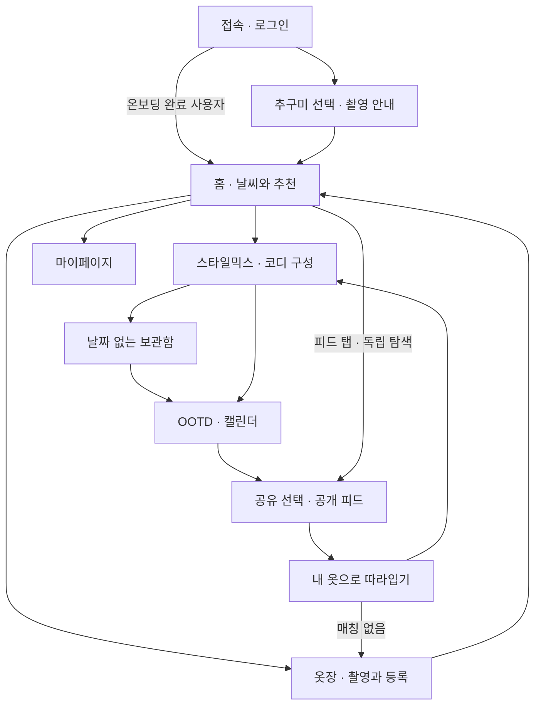
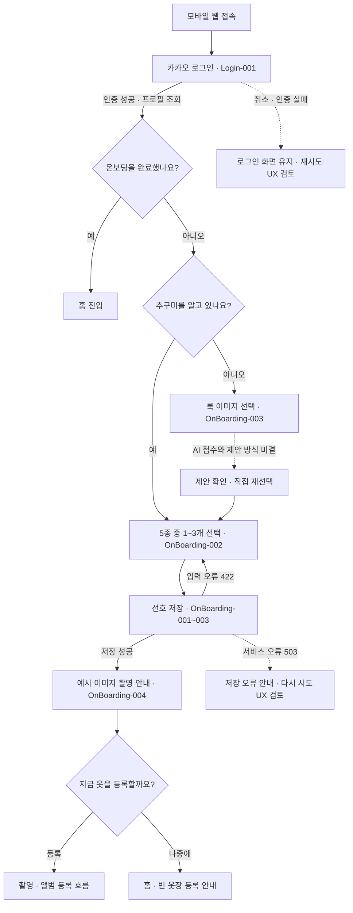
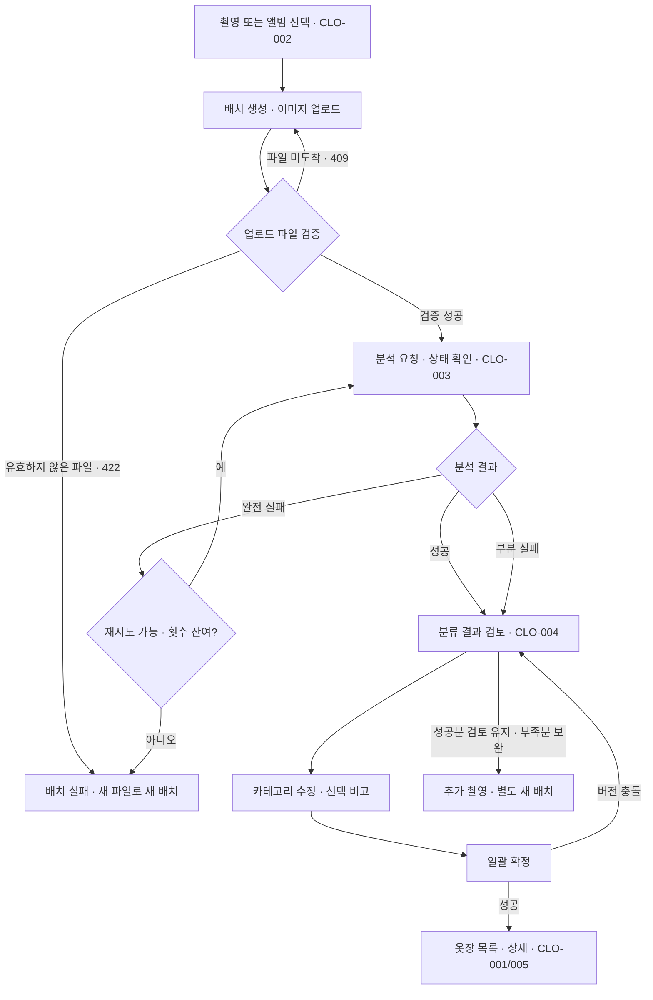
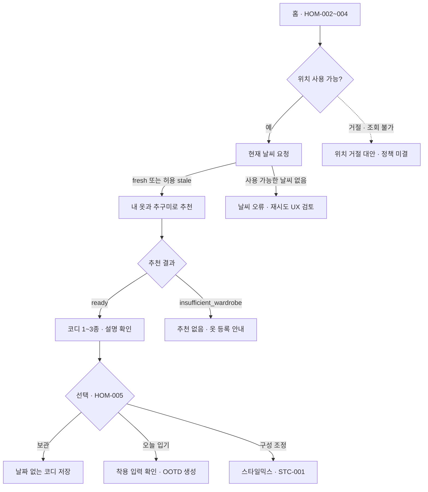
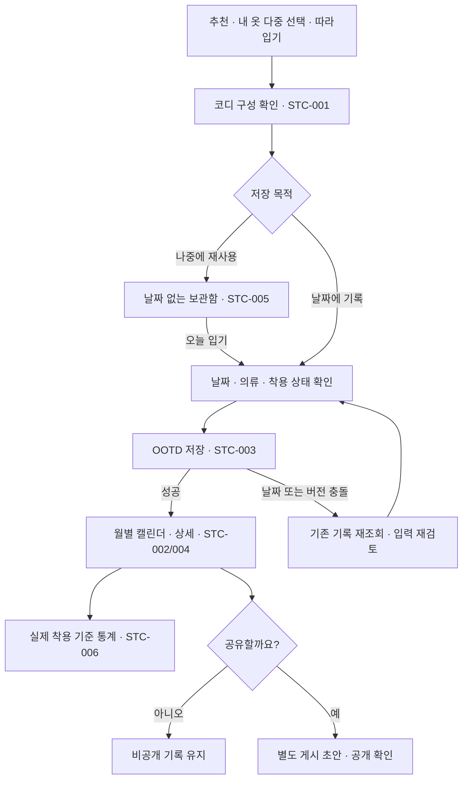
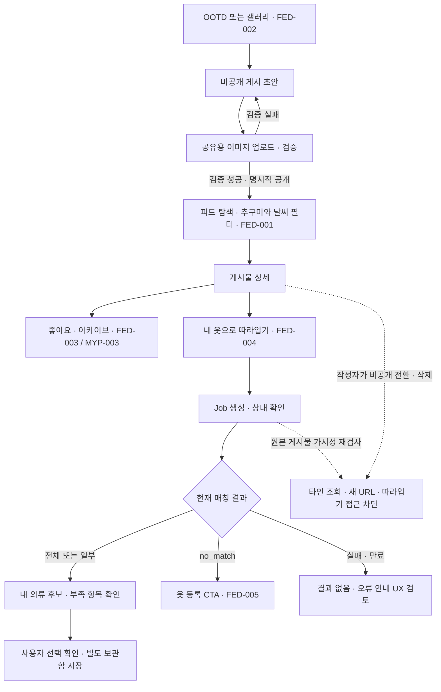

# 마피코 사용자 여정 검토본

기준일: 2026-10-02. 모바일 브라우저 사용을 기준으로 온보딩부터 옷 등록, 코디 기록, 공유와 따라입기를 연결한다. 사용자 최종 검토 전 문서다.

그림의 실선은 요구사항 또는 현재 API 계약에 있는 연결이며, 화면 구현 완료를 뜻하지 않는다. 점선은 미결 정책·외부 미검증·추가 설계가 필요한 연결이다. `[요구]`는 제품 요구사항, `[로컬]`은 백엔드 로컬 구현 증거, `[외부 미검증]`은 실제 서비스 연동 검증 부재, `[미결]`은 팀 결정 대기를 뜻한다. 색상 없이도 각 그림 뒤 상태 설명으로 구분할 수 있다.

백엔드는 G8 기록과 coverage registry 기준 49/50 operation이 로컬 구현 상태다. 카카오 로그인, hosted Supabase, 실제 AI worker와 프론트엔드 화면의 통합 완료를 의미하지 않는다. 아래 테스트 숫자는 기존 작업 기록의 결과이며 이번 시각자료 작업에서 재실행하지 않았다.

## 1. 전체 여정

`SYS-001`의 4탭은 홈·옷장·스타일믹스/캘린더·피드다. 보관함과 마이페이지의 최종 배치 위치를 별도 탭으로 확정하지 않는다. `[요구]` 첫 촬영을 건너뛰어도 홈에 진입할 수 있다. 피드 탐색과 마이페이지는 추천 성공을 전제로 하지 않는 독립 경로다.

근거: [PRD](../../backend/docs/product/PRD.md), [기존 사용자 흐름](../../backend/docs/design/USER_FLOWS.md), [결정 기록](../../backend/records/decisions/DECISIONS.md).

## 2. 로그인 · 온보딩

`[로컬]` G1은 선호 1~3개 저장, 온보딩 상태 저장, 활성 추구미 목록 조회를 검증했다. `[외부 미검증]` 실제 카카오 인증과 hosted Auth 연동은 남아 있다. 오류 후 문구·포커스·재시도 화면은 `[요구]`를 구현할 UX 검토 항목이며 이미 구현된 화면으로 보지 않는다.

`[미결]` 최종 5종 이름과 정의, 대표/보조 표현, 룩 이미지 수·채점 방식. 과거 seed 이름을 최종 명칭으로 제시하지 않는다. 촬영 안내와 실제 촬영을 구분하며 첫 옷 등록을 온보딩 완료의 필수 조건으로 강제하지 않는 PRD 방향을 유지한다.

근거: [PRD Login·OnBoarding](../../backend/docs/product/PRD.md), [G1 결과](../../backend/worklogs/2026-09-30_G1_ACCOUNT_ONBOARDING_RESULT.md), [OpenAPI](../../backend/docs/openapi.yaml).

## 3. 촬영 · 분석 · 옷장 확정

`[로컬]` G2~G4의 업로드 검증, 분석 상태·draft 조회/수정, 원자 확정과 옷장 CRUD에 대응한다. 부분 실패는 성공한 draft를 검토·확정하거나 새 배치로 보완한다. 같은 분석 job 재시도는 `failed`이고 `retryable`이며 잔여 시도가 있을 때만 허용된다. 업로드 URL 만료 시 재발급 API가 있으나, 이미 invalid로 종결된 배치를 되살리는 기능은 아니다.

`[외부 미검증]` 실제 이미지 업로드, AI 분할·누끼·분류 결과 및 지연은 hosted/worker 검증이 남아 있다. `[요구]` 사용자 편집은 카테고리와 선택 비고를 중심으로 하며 색상·추구미 편집 UI를 추가하지 않는다. 모델 원본 예측과 사용자 수정값은 구분한다.

근거: [G2 옷장](../../backend/worklogs/2026-09-30_G2_CLOSET_RESULT.md), [G3 업로드](../../backend/worklogs/2026-09-30_G3_UPLOAD_RESULT.md), [G4 분석](../../backend/worklogs/2026-10-01_G4_ANALYSIS_RESULT.md), [OpenAPI 재시도 계약](../../backend/docs/openapi.yaml).

## 4. 날씨 · 추천 · 코디 선택

`[로컬]` G5는 날씨 조회, 추천 생성/조회/채택을 구현했다. 추천 부족 시 빈 배열과 `insufficient_wardrobe`, 요청 개수보다 적은 경우 `shortfall_reasons`를 구분한다. 날씨는 현재 slot에서 10분 fresh, provider 실패 시 3시간까지의 stale을 허용하는 로컬 계약이다. 위치 거절 시 임의 위치를 자동 입력하는 흐름은 확정하지 않았다.

`[요구]` HOM-004의 LLM 설명과 `[로컬]` 구현은 차이가 있다. 현재는 결정적 추천 엔진과 검증된 fact 기반 template 설명이며 자유 형식 LLM 연동 완료가 아니다. `[외부 미검증]` 실제 날씨 provider와 hosted 추천 E2E. `[미결]` TPO 로직 유지, 05시/07시 생성, 선호 변경 후 갱신 정책. 홈 TPO 칩은 최신 PRD에서 제외됐다.

근거: [G5 결과](../../backend/worklogs/2026-10-01_G5_RECOMMENDATION_RESULT.md), [PRD HOM](../../backend/docs/product/PRD.md), [OpenAPI 추천 응답](../../backend/docs/openapi.yaml).

## 5. 보관함 · OOTD · 통계

`[로컬]` G6은 보관 코디와 OOTD CRUD, 착용 통계를 구현했다. 보관 코디 수정·삭제가 과거 OOTD snapshot을 바꾸지 않으며 현재 사용할 수 없는 의류는 조회에서 별도 표시한다. 피드가 참조하는 OOTD와 추천 채택 replay 대상 OOTD는 현재 수정·삭제가 차단되므로 모든 기록이 언제나 수정 가능하다고 표시하지 않는다.

`[미결]` 하루 OOTD 수와 `wear_status` 제품 정책. 현재 계약에는 하루 1개 제약과 `planned`/`worn` 구분이 있으나 팀 최종 확정과 구분한다. 실제 착용만 통계에 반영하는 현재 구현을 그림에 반영했다. OOTD 저장 자체는 공개 게시 동의가 아니며 보관함의 최종 화면 위치도 미결이다.

근거: [G6 결과](../../backend/worklogs/2026-10-01_G6_OUTFIT_OOTD_RESULT.md), [API 설계](../../backend/docs/API_DESIGN.md), [기존 흐름의 정책 주의](../../backend/docs/design/USER_FLOWS.md), [PRD STC](../../backend/docs/product/PRD.md).

## 6. 공개 게시 · 좋아요 · 따라입기

`[로컬]` G7은 공유 media 검증 후 공개 전환, 좋아요/취소, 내 게시물·좋아요 목록을 구현했다. 개인 옷장 원본을 공개하지 않고 별도의 공유 복사본을 사용한다. 비공개 전환·철회는 새 조회와 URL 발급을 차단하지만 이미 발급된 signed URL의 즉시 무효화를 보장한다는 뜻은 아니다.

`[로컬]` G8은 따라입기 job 생성/조회와 callback 경계를 구현했다. 일부 매칭도 성공 결과가 될 수 있으며 유효 후보가 사라지면 `no_match`로 표시한다. 따라입기는 자동 저장되지 않고 G6 보관 API를 별도로 호출한다. 유사도는 확률이 아니므로 “일치 확률 95%”로 표현하지 않는다. `[외부 미검증]` 실제 AI worker 매칭 정확도·지연과 공유 Storage E2E.

근거: [G7 결과](../../backend/worklogs/2026-10-01_G7_FEED_RESULT.md), [G8 결과](../../backend/worklogs/2026-10-01_G8_MIMIC_RESULT.md), [API 설계](../../backend/docs/API_DESIGN.md).

## 7. 마이페이지와 검토할 차이

`HOM-001`에서 마이페이지로 진입해 `MYP-001` 프로필, `MYP-002` 추구미 재선택, `MYP-003` 좋아요 목록, `MYP-005` 내 게시물을 관리한다. 닉네임·선호 저장과 목록 API에는 로컬 구현 근거가 있으나 프로필 사진 변경은 현재 `avatar_asset_id`가 422로 거절된다. `MYP-004` 로그아웃은 Auth 클라이언트 흐름이며, 계정 탈퇴 operation은 coverage에서 아직 planned다. 탈퇴·Storage·공개 게시물의 파기 완료 화면을 구현 완료로 제시하지 않는다.

사용자 검토 시 우선 확인할 항목은 최종 추구미 이름·탐색 방식, 위치 거절 안내, 보관함 위치, 하루 OOTD/착용 상태, 추천 갱신 시점이다. 이 문서의 오류 안내 화면은 계약의 실패 상태를 사용자에게 연결하는 검토안이며 최종 문구와 화면 설계 승인을 대신하지 않는다.

근거: [G1 결과](../../backend/worklogs/2026-09-30_G1_ACCOUNT_ONBOARDING_RESULT.md), [coverage registry](../../backend/coverage/implementation.json), [PRD MYP와 미결 정책](../../backend/docs/product/PRD.md).
