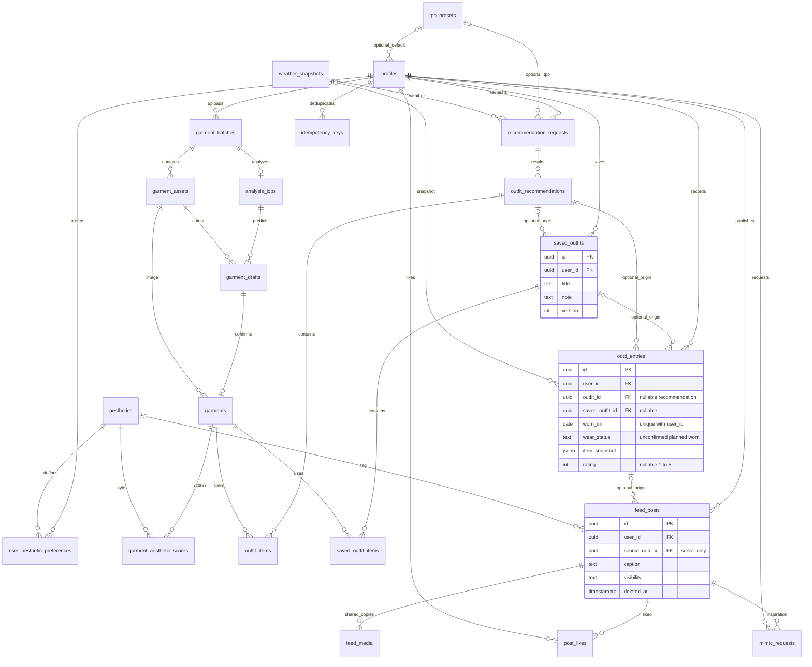

# 마피코 ERD v0.3

실제 SQL의 핵심 관계. auth.users/storage 객체는 외부 플랫폼 영역이며 총 public 테이블 22개다. 제품 단계 신규 관계를 포함하되 API 구현 완료를 뜻하지 않는다.

테이블 접근·필드 정의·미결 사항은 [DB 설계](DB_DESIGN.md)를 기준으로 한다. 공개 게시물과 비공개 OOTD/옷장 데이터는 분리된다. 선호 무드보드·pgvector 차원은 아직 스키마에 고정하지 않았다.
